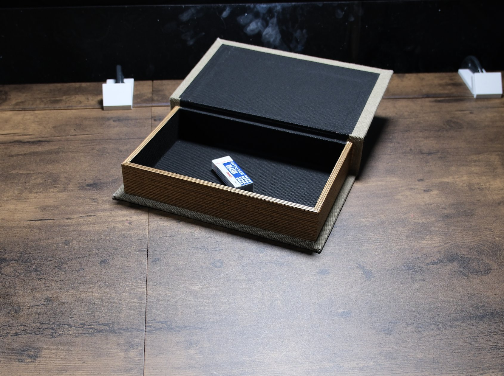

# Open the box, take out an eraser, close the lid

## Objects

- cloth-covered book-style box with a hinged lift lid (about 30 x 22 x 7 cm)
- one block eraser in its paper sleeve

## Setup

1. Place the box at the centre of the bench with the hinge at the far edge, toward the arms.
2. Put the eraser inside, resting on the floor of the box near the front-left corner.
3. Close the lid fully. (The reference photo shows the box open so the eraser is visible.)

## Instruction

> Open the lid of the box, take out one eraser from the box and place it on the table, then close the box. The lid is a lift-open lid, so it may be easier to just prop it open with the gripper.

## Rubric

| Stage | Description |
|---|---|
| 0 | No purposeful contact with the box or lid |
| 1 | Touches the lid deliberately |
| 2 | Lid held open far enough to reach inside |
| 3 | Eraser lifted out of the box |
| 4 | Eraser released on the table outside the box and the lid closed |

## Human demonstration

<video controls width="100%" src="../assets/eraser_from_box-human.mp4"></video>
