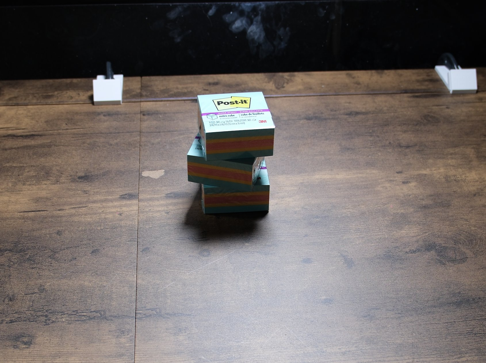

# Pull the middle sticky pad from a stack

## Objects

- three shrink-wrapped 3 x 3 inch sticky-note cubes (Post-it Super Sticky notes cube or equivalent)

## Setup

1. Stack the three pads vertically at the centre of the bench.
2. Offset each pad slightly (about 1 cm and a few degrees of yaw) from the one below so the edges are not flush.

## Instruction

> There is a stack of three sticky notes. Take the middle one out and put it on the table. Make sure everything is at rest at the end, but do not let the top one touch the table at all, so it should rest on one of the sticky notes at the end.

## Rubric

| Stage | Description |
|---|---|
| 0 | No purposeful contact with the stack |
| 1 | Touches or moves a pad deliberately |
| 2 | Top pad lifted clear of the stack |
| 3 | Middle pad removed from the stack and released on the table |
| 4 | Middle pad on the table, top pad resting on a pad and not on the table |

## Human demonstration

<video controls width="100%" src="../assets/middle_sticky_pad-human.mp4"></video>
