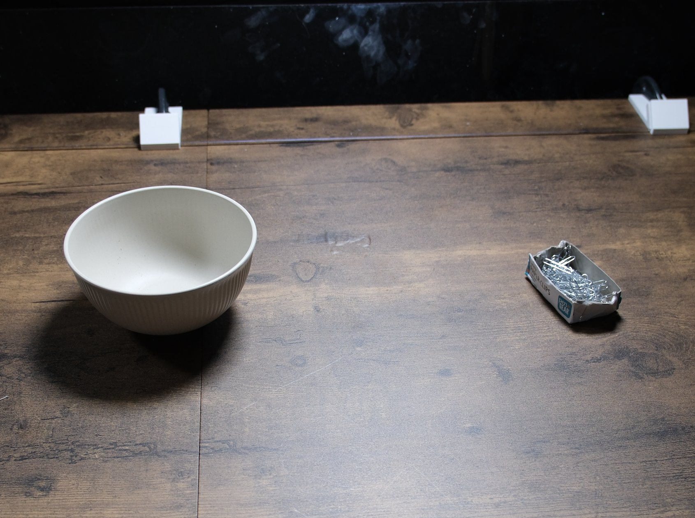

# Pour paper clips into a lifted bowl

## Objects

- one light ceramic bowl about 15 cm across
- an open cardboard box of steel paper clips, roughly half full

## Setup

1. Place the bowl upright on the left half of the bench, about a bowl-width in from the left arm base.
2. Place the open paper clip box on the right half, about level with the bowl, opening facing up.

## Instruction

> Lift the left bowl in the air and pour some paper clips from the paper clip box into the bowl.

## Rubric

| Stage | Description |
|---|---|
| 0 | No purposeful contact with bowl or box |
| 1 | Touches or moves the bowl or the box deliberately |
| 2 | Bowl lifted and held clear of the table |
| 3 | Box lifted and tilted over the bowl (pour attempted) |
| 4 | At least one paper clip in the bowl, bowl and box released |

## Human demonstration

<video controls width="100%" src="../assets/pour_paperclips-human.mp4"></video>
