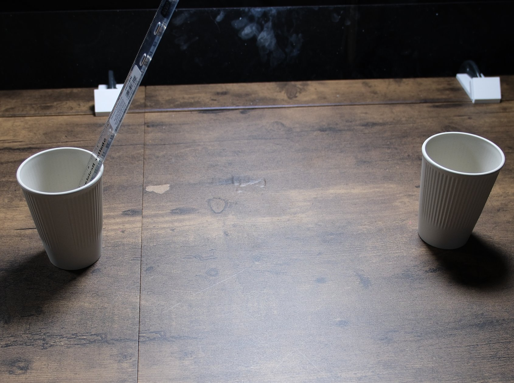

# Hand a ruler between arms, cup to cup

## Objects

- two paper cups (about 12 oz)
- one clear plastic 12 inch (30 cm) ruler

## Setup

1. Stand one cup near the left arm and one near the right arm, at the same distance from the arm bases, so the ruler cannot be moved without a handover.
2. Stand the ruler in the left cup, leaning toward the far edge of the bench.
3. Leave the right cup empty.

## Instruction

> Transfer the ruler from the left cup to the right cup, but you must hand it over to the other arm's gripper in mid-air.

## Rubric

| Stage | Description |
|---|---|
| 0 | No purposeful contact with the ruler |
| 1 | Touches or moves the ruler deliberately |
| 2 | Ruler lifted clear of the left cup in one gripper |
| 3 | Ruler held by the other gripper after a mid-air handover |
| 4 | Ruler standing in the right cup and released |

## Human demonstration

<video controls width="100%" src="../assets/ruler_handover-human.mp4"></video>
