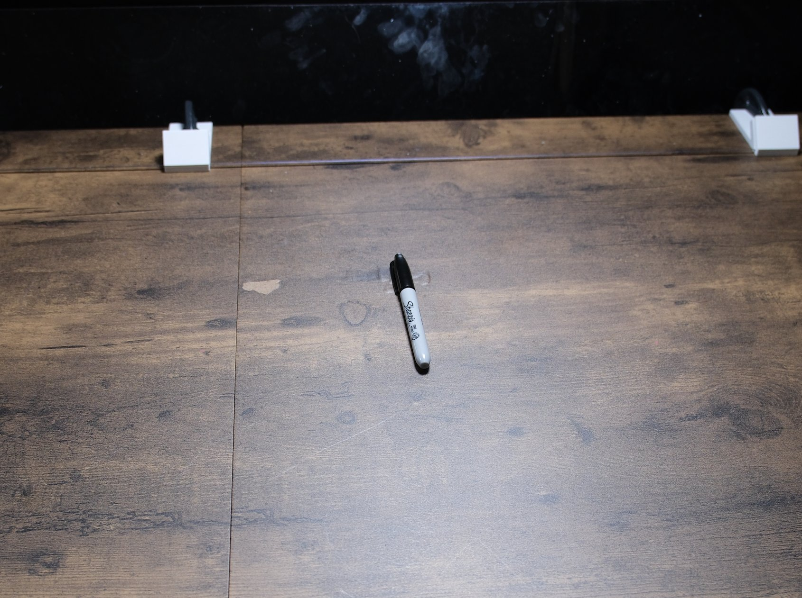

# Uncap the marker

## Objects

- black Sharpie fine-point permanent marker, capped

## Setup

1. Cap the marker fully.
2. Lay it flat at the centre of the bench, roughly midway between the two arm bases, aligned front-to-back with the cap toward the arms.

## Instruction

> Pull the cap off the sharpie and place them separately on the table.

## Rubric

| Stage | Description |
|---|---|
| 0 | No purposeful contact with the marker |
| 1 | Touches or moves the marker deliberately |
| 2 | Holds the marker securely in one gripper |
| 3 | Cap separated from the body, either part still held |
| 4 | Cap and body both released on the table |

## Human demonstration

<video controls width="100%" src="../assets/uncap_marker-human.mp4"></video>
